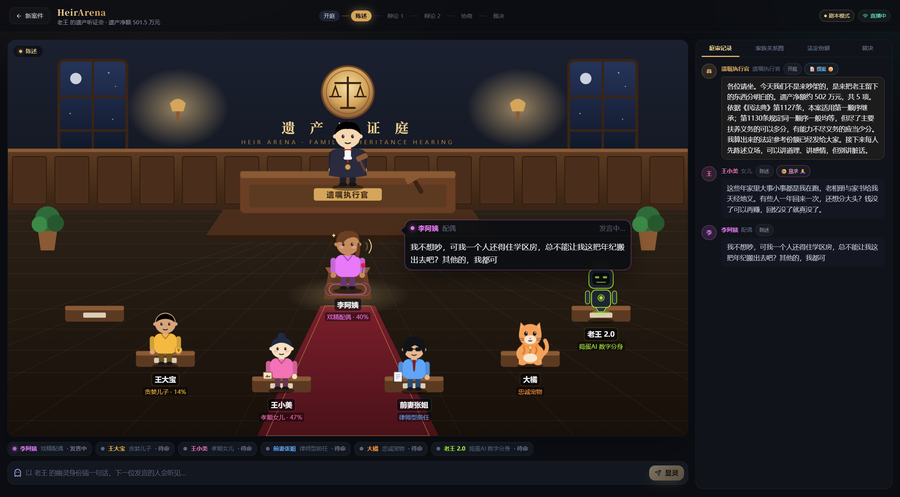

# HeirArena · 遗产竞技场

> 把严肃的遗产分配，变成一场 AI 多 Agent 的「家庭剧 + 辩论竞技场」。
> 你是立遗嘱的人：填好资产、家人和几句"剧情设定"，系统就会生成一群性格鲜明的 AI 继承人，
> 让它们在虚拟听证庭上争吵、结盟、谈判——最后由中立的「遗嘱执行官」依据《民法典》继承编敲槌裁决。



## 它是怎么玩的

1. **立遗嘱**：输入资产清单（房子、车、加密货币、NFT、宠物、收藏品……）、家人关系（配偶、子女、父母、继子女、代位的孙子女、丧偶儿媳、前任、保姆、宠物、AI 数字分身……）和剧情设定（"儿子五年没回家""我最爱那只猫"）。四个一键剧本可直接开庭。
2. **规则引擎先算法定份额**：依据《民法典》第 1122、1125、1127、1128、1129、1130、1131、1132、1144、1153、1156 条，确定性地算出每个人的参考份额与法条依据（夫妻共同财产先析产、代位继承、继子女扶养关系、丧偶儿媳视为第一顺序、多分 / 少分、被扶养人酌分……）。这是整场辩论不可逾越的"锚"。
3. **开庭**：遗嘱执行官宣读案情 → 每位 Agent 开场陈述 → 若干轮辩论（攻击 / 结盟 / 提案 / 让步）→ 协商 → 落槌裁决。
4. **幽灵插话**：庭审进行中，你可以随时以"逝者的幽灵"身份插一句话，下一位发言的 Agent 会当场做出反应。
5. **裁决**：执行官在法定份额 ±15 个百分点内酌情调整，把不可分割的房、车、宠物、纪念物给最在乎它的人，用存款找平、不够就折价补偿（第 1156 条），宠物附照护义务（第 1144 条）。输出饼图、逐项资产归属、补偿关系、调整理由、法条依据，并可导出 Markdown 庭审记录。

## 视觉

- 等距风格 SVG 法庭：木质墙板、天平徽章、夜窗与壁灯、法官席、证人台、红毯与家属席。
- 程序化生成的 Agent 小人：法官袍与法槌、贪婪者的金币、孝顺者的相框、精算师的眼镜、律师的领带与文书、前任的墨镜、捣蛋鬼的小角；宠物是会摇尾巴的猫 / 狗；AI 分身是带天线的机器人。
- 状态动画：思考气泡、发言声波、生气冒烟、开心闪光；发言者走上证人台、聚光灯亮起；攻击画红色虚线、结盟画绿色实线；落槌时全屏震动 + "咚！"。
- 右侧面板：家族关系图（含 ✝ 先亡、代位、婚姻 / 已离婚、无继承权标注）、法定份额与法条全文、实时庭审记录、最终裁决。

## 技术栈

| 层 | 技术 |
| --- | --- |
| 前端 | Vite 8 · React 19 · TypeScript · Tailwind CSS 4 · Motion · Zustand · Recharts · React Router |
| 后端 | Python 3.10+ · FastAPI · SSE 实时流 · httpx（OpenAI 兼容流式接口） |
| Agent | 遗嘱执行官 + 按家庭成员生成的角色 Agent（8 种性格）· 有限自主裁量的裁决器 · 资产分配 / 折价补偿算法 |
| 法律 | 《民法典》继承编规则引擎（含单元测试） |

**两种运行模式**：配置了 `LLM_API_KEY` 时由大模型驱动每个 Agent 的发言与执行官裁决（任意 OpenAI 兼容接口：DeepSeek / 通义 / Moonshot / 智谱 / OpenAI）；未配置时进入 **剧本模式**，用内置的角色台词库演一场完整听证会，开箱即可演示。大模型调用失败会自动回退到剧本模式，庭审不会中断。

## 快速开始

```powershell
# Windows
.\start.ps1
```

```bash
# macOS / Linux
chmod +x start.sh && ./start.sh
```

或手动启动：

```bash
# 后端（http://127.0.0.1:8000，接口文档 /docs）
cd backend
python -m venv .venv && .venv/Scripts/activate   # macOS/Linux: source .venv/bin/activate
pip install -r requirements.txt
cp .env.example .env                              # 可选：填入 LLM_API_KEY / LLM_BASE_URL / LLM_MODEL
uvicorn app.main:app --reload --port 8000

# 前端（http://localhost:5173，已代理 /api 到后端）
cd frontend
npm install
npm run dev
```

## 目录结构

```
backend/
  app/
    main.py               # FastAPI：创建会话 / SSE 流 / 幽灵插话 / 导出
    models.py             # 案件、资产、成员、法定份额等数据模型
    legal/
      articles.py         # 民法典继承编条文（节选）
      engine.py           # 法定继承规则引擎
    agents/
      personas.py         # 角色人设与提示词片段
      mock.py             # 剧本模式台词库
      llm.py              # OpenAI 兼容流式客户端
      allocator.py        # 份额 → 具体资产归属 + 折价补偿
      orchestrator.py     # 听证会编排：开庭 / 陈述 / 辩论 / 协商 / 裁决
  tests/                  # 规则引擎、分配器、编排器、流式解析测试
frontend/
  src/
    pages/SetupPage.tsx        # 立遗嘱向导（含法定份额实时预览）
    pages/CourtroomPage.tsx    # 法庭页：场景 + 阶段进度 + 面板 + 幽灵插话
    components/scene/          # 法庭场景、Agent 小人、气泡、连线、落槌
    components/panels/         # 关系图 / 法定份额 / 庭审记录 / 裁决
    store/useCourt.ts          # SSE 事件 → 状态
    data/presets.ts            # 一键剧本与选项
```

## API 速览

| 方法 | 路径 | 说明 |
| --- | --- | --- |
| GET | `/api/config` | 当前模式（llm / mock）与模型 |
| POST | `/api/legal/preview` | 仅计算法定份额（设置页实时预览） |
| POST | `/api/sessions` | 创建会话并立即开庭 |
| GET | `/api/sessions/{id}/stream` | SSE 事件流（支持 `?from_seq=` 断线续播） |
| POST | `/api/sessions/{id}/interject` | 幽灵插话 |
| GET | `/api/sessions/{id}/export` | 导出 Markdown 庭审记录 |

SSE 事件：`session_start` `phase` `agent_status` `speech_start` `speech_delta` `speech_end` `relation` `reaction` `ghost` `notice` `gavel` `verdict` `done`。

## 测试

```bash
cd backend && .venv/Scripts/python -m pytest -q     # 16 个用例
cd frontend && npm run build                          # 类型检查 + 打包
```

## 免责声明

本项目给出的是依据《民法典》继承编计算的**参考方案**与一场娱乐化的多 Agent 模拟，不构成法律意见；真实纠纷请咨询律师或通过调解、诉讼解决。
