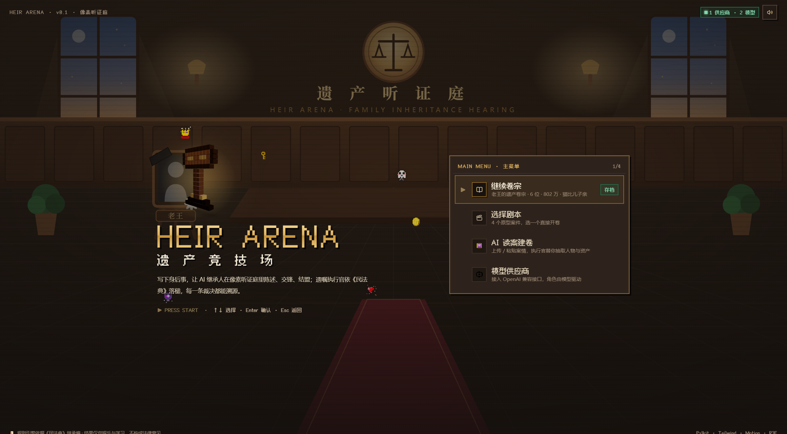
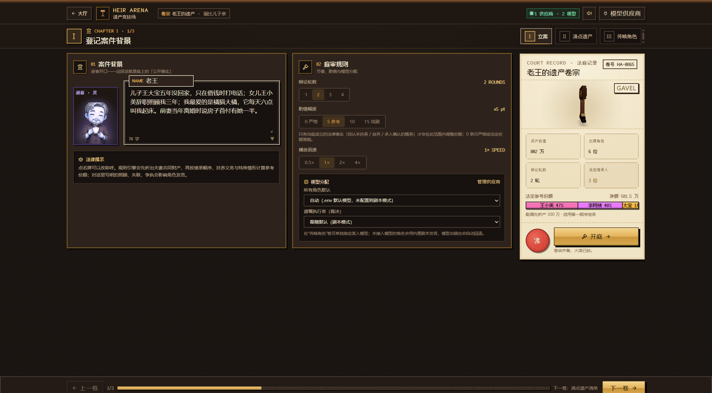
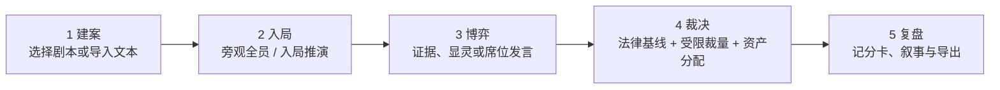
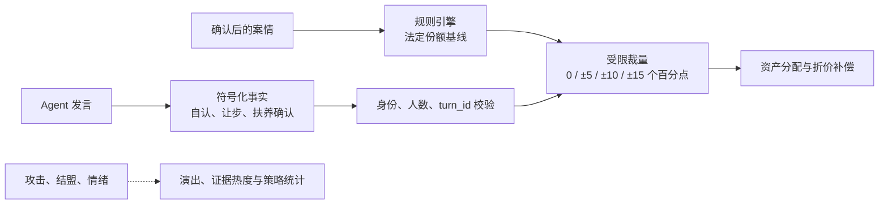

# HeirArena · 遗产竞技场

[](https://github.com/hxquan-q/HeirArena/actions/workflows/ci.yml)
[](LICENSE)
[](backend/requirements.txt)
[](frontend/package.json)

> **像素风 Web 剧本杀式多 Agent 案件利益沙盘。**
> 选择身份与诉求，看 AI 角色在结盟、举证、谈判和庭审中争夺遗产；法律规则守住分配底线，Agent 负责把过程演成一场戏。



HeirArena 把遗产案件变成一个可以反复推演的互动沙盘：输入人物、资产和公开事实，多名继承人 Agent 会围绕各自诉求陈述、攻击、结盟、提案与让步，最后由遗嘱执行官依据规则引擎给出的法定基线完成裁决和具体资产分配。

当前版本有两种开庭模式：默认**导演 / 逝者幽灵**旁观全员；也可以切入**入局推演**，选定“我是案件中的谁”，写下诉求，让军师为全员写策略简报，再由 AI 代理或亲自发言把这场沙盘打完。执行官对席位盲判，份额仍只随当庭事实变动，军师建议不构成法律意见。

## 最新实机画面

| 建立案件与调节庭审 | 多 Agent 庭审进行中 |
| :---: | :---: |
|  |  |

| 时间线、证据、显灵技能、终局预测与裁决 |
| :---: |
|  |

## 它为什么不只是聊天机器人

- **身份驱动**：每个 Agent 都有家庭关系、性格、资产偏好、公开立场和诉求。
- **焦点驱动**：执行官从案情归纳争议焦点，辩论逐轮围绕焦点推进。
- **证据卡牌**：资产、卷宗事实和当庭证言会变成带热度、法条与来源回合的卡牌。
- **幽灵技能**：显灵能量按阶段恢复；五种技能会组合当前案情、发言和所选证据生成干预。
- **局势预测**：实时把各方最新资产主张折算成价值份额，显示争夺热度和焦点进度。
- **阵营与时间线**：保留全场攻击、结盟、阶段、幽灵和裁决事件，形成可回看的案件过程。
- **规则兜底**：Python 规则引擎先计算法定份额，模型不能随口编一个百分比。
- **结果落地**：系统不只画份额饼图，还会分配房产、车辆、存款、宠物并计算折价补偿。
- **没有模型也能玩**：未配置供应商时进入内置剧本模式；单次模型失败只让该回合降级。

## 五步推演



1. **建案**：使用内置剧本，手动编辑卷宗，或导入 UTF-8 的 Markdown / 纯文本案情。
2. **入局**：默认旁观全员；也可在第 IV 卷选席位、写诉求、推演策略后以当事人身份开庭。
3. **博弈**：旁观时查看时间线、证据宝箱、阵营网络和终局预测，用显灵技能影响下一位 Agent；入局时关闭显灵，轮到你可亲自发言或改由 AI 代说。
4. **裁决**：规则引擎计算基线，执行官只可依据成立且可追溯的事实，在设定幅度内调整。
5. **复盘**：查看判决书、成立事实、未决问题、论点分析、和解方案、资产归属和押注结果；入局场次另有记分卡与下一局建议。
6. **入局推演**：选定席位 → 写结构化诉求与自由文本 → 军师生成全员简报与策略矩阵 → AI 代打或亲自发言（发言卡辅助，自认只能手动勾选）→ 闭庭后看记分卡、叙事复盘并导出「入局推演报告」。执行官对席位盲判、份额仍只随当庭事实变动、军师建议不构成法律意见。

## 三层结果

| 层 | 回答的问题 | 当前状态 |
| --- | --- | --- |
| **法律层** | 谁有资格继承、法定份额是多少、哪些事实可调整、资产如何落位？ | 已实现 |
| **策略层** | 哪些主张、证据、结盟或让步有效，我怎样更接近自己的诉求？ | 入局推演已提供可达区间、what-if、全员简报、博弈表、记分卡与复盘；旁观模式仍用证据卡、主张预测、阵营网络和押注 |
| **剧情层** | 谁和谁结盟、关系如何变化、这场家庭剧怎样收尾？ | 已有关系事件、角色反应、戏剧值、时间线和裁决叙事 |

更多说明：[产品设计](docs/product.md) · [技术架构](docs/architecture.md) · [可编辑图表](docs/diagrams.md) · [入局推演设计说明](docs/入局推演-设计说明.md)

“入局推演”从席位模型、军师简报到玩家亲自发言与确定性记分卡的实施拆分，见 [`task/README.md`](task/README.md)。

## 快速开始

### Windows

```powershell
.\start.ps1
```

### macOS / Linux

```bash
chmod +x start.sh
./start.sh
```

启动后访问：

- 游戏界面：<http://localhost:5173>
- FastAPI 文档：<http://127.0.0.1:8000/docs>

手动启动：

```bash
# 后端
cd backend
python -m venv .venv
# Windows: .venv\Scripts\activate
# macOS / Linux: source .venv/bin/activate
pip install -r requirements.txt
uvicorn app.main:app --reload --port 8000

# 前端（另一个终端）
cd frontend
npm install
npm run dev
```

无需 API Key 即可使用**剧本模式**体验完整流程。若要让 Agent 实时生成发言，可复制 `backend/.env.example` 为 `backend/.env`，或在游戏大厅打开“模型供应商”配置。

## 导入自己的案件

导入页接受不超过 300 KB / 10 万字符的 UTF-8 `.md`、`.markdown` 和 `.txt` 文本；可参考 [`examples/sample-case.md`](examples/sample-case.md)。

解析需要一个可用模型。模型先输出抽取结构，后端再校验人物、关系、金额、枚举值和影响法律计算的原文引用。结果只会形成待确认草稿，不会直接开庭。

> 建议只使用虚构、匿名化或充分脱敏的材料。导入文本和庭审上下文可能发送到你选择的模型供应商。

## 模型供应商与角色路由

支持 DeepSeek、通义千问、Moonshot Kimi、智谱 GLM、火山方舟、硅基流动、OpenAI、OpenRouter、Ollama、LM Studio、自定义 OpenAI 兼容端点，以及可选的本地 Codex Bridge。

同一场庭审可以分别设置：

1. 全体角色默认模型；
2. 遗嘱执行官专用模型；
3. 单个案件角色模型；
4. **军师**（`seat.advisor_model`）：只在入局推演里使用，默认跟随执行官。负责矩阵要点、全员简报、发言卡、软目标评分和叙事复盘。未接入时降级为规则版简报，仍可开庭和打字发言。

不同角色可以混用不同供应商，也可以让部分角色使用剧本模式。供应商配置保存在本机 `backend/data/providers.json`，列表接口不会把完整 Key 返回浏览器。旁观模式下军师槽位提示「仅入局模式使用」。

## 法律与 Agent 如何协作



当前可进入份额调整路径的符号化事实：

- `admit_neglect`：本人承认有能力却未尽扶养义务；
- `waive_share`：本人明确放弃部分份额；
- `acknowledge_support:<id>`：确认另一成员尽了主要扶养义务，并满足多人确认规则。

普通指控、口才、攻击、结盟、押注和戏剧值不会直接改变份额。执行官模型输出还要经过事实白名单、发言引用和数学边界校验；失败时回退到纯规则裁决。

## 技术栈

| 层 | 技术 |
| --- | --- |
| 前端 | Vite 8 · React 19 · TypeScript · Tailwind CSS 4 · Motion · Zustand · React Router |
| 游戏表现 | PxlKit · Fusion Pixel · React Three Fiber · Three.js · Recharts |
| 后端 | Python 3.10+ · FastAPI · SSE · SQLModel · SQLite · httpx |
| Agent | LangChain `create_agent()` · 多供应商 OpenAI 兼容模型路由 · 内置剧本回退 |
| 编排 | LangGraph 状态机 · SQLite Checkpointer · 节点级休庭 / 续庭 |
| 规则 | 《民法典》继承编有限规则引擎 · 受限裁量 · 资产分配与折价补偿 |

## 项目结构

```text
HeirArena/
├─ backend/
│  ├─ app/
│  │  ├─ agents/          # 角色、工具、LangGraph、编排、裁决与恢复
│  │  ├─ legal/           # 法条、确定性继承规则、举证清单 evidence.py
│  │  ├─ seat/            # 入局：analysis / game / scoring / advisor / prompts / report
│  │  ├─ main.py          # FastAPI、SSE 与会话生命周期
│  │  ├─ case_parser.py   # 文本案情抽取与原文引用校验
│  │  ├─ providers.py     # 模型供应商与路由
│  │  └─ persist.py       # 案件、事件、发言与裁决持久化
│  └─ tests/              # 含 test_seat_*.py
├─ frontend/
│  └─ src/
│     ├─ pages/           # 大厅、导入、设置、庭审
│     ├─ components/      # 像素场景、证据/阵营/预测面板、显灵行动栏
│     ├─ components/seat/ # 第 IV 卷、简报、复盘、博弈表
│     ├─ lib/             # 证据、主张预测、显灵技能与音效
│     ├─ store/           # 案件草稿、SSE 庭审状态与玩家场次存档
│     └─ api/             # REST 与 SSE 客户端
├─ assets/                # 角色像素立绘
├─ docs/                  # 产品、架构、图表与入局推演设计说明
├─ task/                  # 入局推演实施任务拆分
└─ examples/              # 可导入的示例案情
```

## API 速览

| 方法 | 路径 | 说明 |
| --- | --- | --- |
| `GET` | `/api/config` | 当前模式与默认模型状态 |
| `GET/POST/PUT/DELETE` | `/api/providers[/{id}]` | 模型供应商管理 |
| `POST` | `/api/cases/parse` | Markdown / 纯文本案情解析 |
| `POST` | `/api/legal/preview` | 计算法定份额预览 |
| `POST` | `/api/seat/analyze` | 入局分析：可达区间、what-if、推断诉求、博弈表 |
| `POST` | `/api/seat/strategy` | 推演全员简报与策略矩阵（无军师时规则版降级） |
| `POST` | `/api/sessions` | 创建并启动庭审 |
| `GET` | `/api/sessions/{id}/stream` | SSE 事件流和断线补播 |
| `PUT` | `/api/sessions/{id}/seat` | 切换「本席由我发言」 |
| `POST` | `/api/sessions/{id}/speak` | 玩家发言或改由 AI 代说 |
| `POST` | `/api/sessions/{id}/cards` | 重新起草发言卡 |
| `POST` | `/api/sessions/{id}/interject` | 幽灵低语与技能干预；**入局会话返回 409** |
| `POST` | `/api/sessions/{id}/pause` | 节点边界休庭；等待玩家时返回 409 |
| `POST` | `/api/sessions/{id}/resume` | 从检查点续庭 |
| `GET` | `/api/sessions/{id}/export` | 导出 Markdown；入局场次追加「入局推演报告」 |

SSE 事件（`frontend/src/api/client.ts` 的 `SSE_EVENTS`，共 19 个）：`session_start` `phase` `focus` `agent_status` `speech_start` `speech_delta` `speech_end` `relation` `reaction` `ghost` `notice` `gavel` `verdict` `done` `error` `seat` `awaiting_player` `cards` `debrief`。后四个只在入局会话出现。

## 路线图

- [x] 像素大厅、卷宗设置和内置案件
- [x] Markdown / 纯文本案情导入
- [x] 多供应商、多模型、按角色路由
- [x] LangGraph 多 Agent 庭审和剧本回退
- [x] 幽灵插话、休庭续庭和 SSE 断线补播
- [x] 显灵能量、五种幽灵技能和证据出示
- [x] 证据卡牌、案件时间线和阵营网络
- [x] 资产争夺热度、终局预测和庭前押注
- [x] 事实约束裁决、资产落位和和解方案
- [x] 入局推演：选席、诉求、军师简报、亲自发言与记分卡
- [ ] 庭上证据卡改变事实、多次推演、对手强度开关
- [ ] 更多案件类型、社区剧本和多人参与

## 测试

```bash
cd backend
python -m pytest -q

cd ../frontend
npm test
npm run build
```

后端入局相关：`test_seat_models` `test_seat_evidence` `test_seat_analysis` `test_seat_game` `test_seat_scoring` `test_seat_api` `test_seat_advisor` `test_seat_prompts` `test_seat_blind` `test_seat_runtime` `test_seat_turn` `test_seat_debrief` `test_seat_export`。前端席位用例在 `useCaseDraft.test.ts`、`useCourt.test.ts`。

## 开源协作

- [贡献指南](CONTRIBUTING.md)
- [产品说明](docs/product.md)
- [技术架构](docs/architecture.md)
- [图表集](docs/diagrams.md)
- [入局推演设计说明](docs/入局推演-设计说明.md)
- [入局推演实施任务](task/README.md)
- [示例案情](examples/sample-case.md)
- [GitHub Issues](https://github.com/hxquan-q/HeirArena/issues)

本项目采用 [MIT License](LICENSE)。

## 免责声明

HeirArena 提供的是娱乐化多 Agent 模拟、教育展示和有限规则下的参考计算，**不构成法律意见，也不预测真实调解或诉讼结果**。入局推演给出的策略与记分卡是基于你输入事实的沙盘推演，不构成法律意见。真实继承纠纷应由具备资质的专业人士结合完整证据和现行法律处理。
