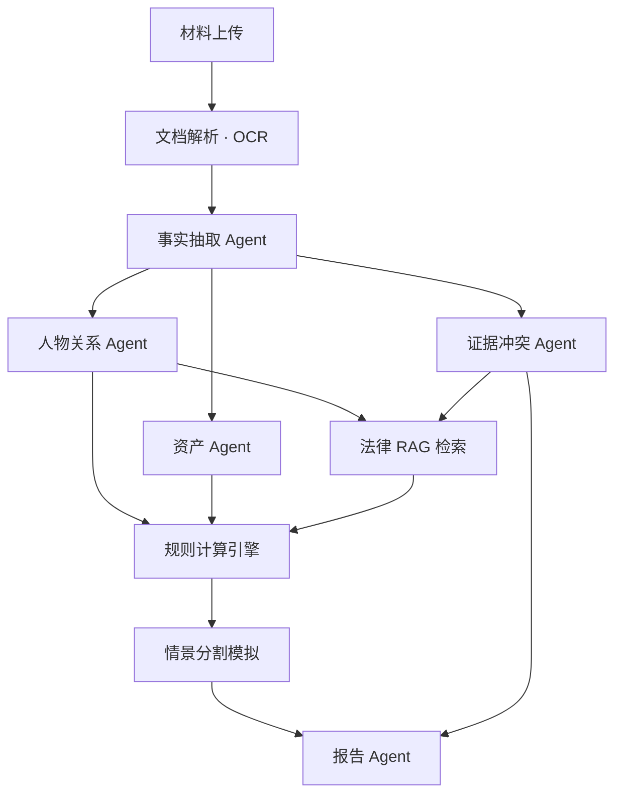
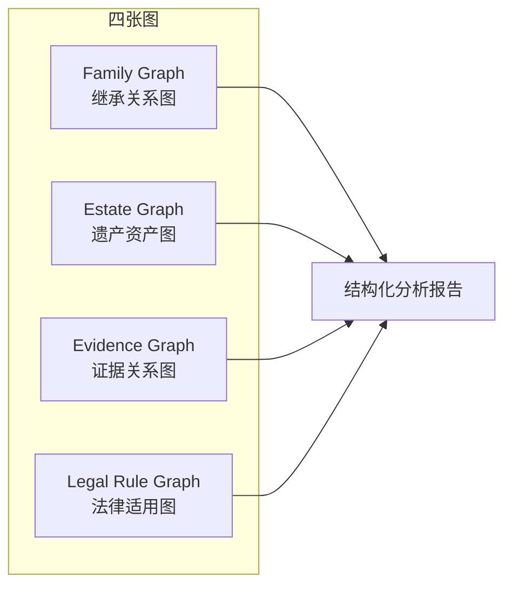
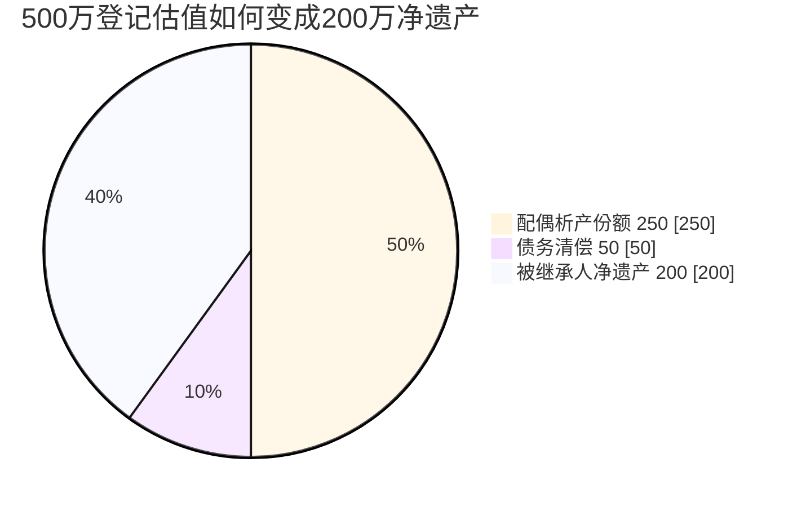
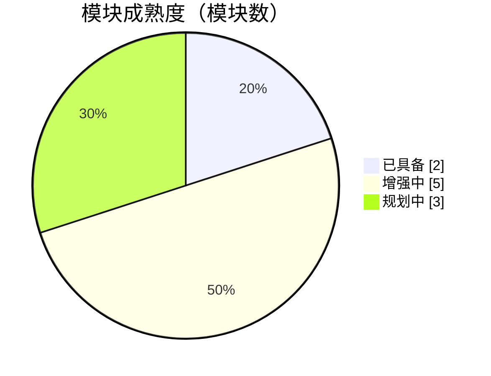
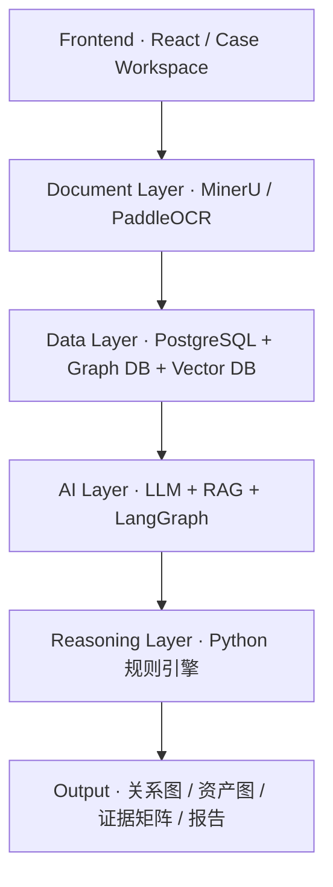
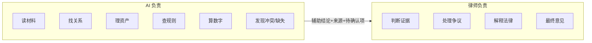

# EstateGraph Agent · 图表集

> 从《项目说明文档 V0.1》拆出的可视化图表，可粘贴到 Notion / 飞书 / PPT，或在 Cursor 中打开交互版 Canvas。  
> 交互版（推荐）：[estate-graph-charts.canvas.tsx](/Users/xquan/.cursor/projects/c-Users-xquan-Desktop-sol/canvases/estate-graph-charts.canvas.tsx)

---

## 图 1 · AI 工作流（有向流程）

**说明**：材料经解析后，事实抽取分三路（人物 / 资产 / 证据），汇入法律 RAG 与规则引擎，再情景模拟并生成报告。  
**图例**：灰色 = 输入/解析；蓝色 = LLM；绿色 = 确定性（检索 + 规则引擎）。

---

## 图 2 · 产品交付：四张图 + 一份报告

| 图谱 | 核心内容 | 成熟度 |
| --- | --- | --- |
| Family Graph | 关系类型 / 时间 / 证据来源 / 可信度 | 增强中 |
| Estate Graph | 总价值 ≠ 份额 ≠ 净遗产 | 增强中 |
| Evidence Graph | 结论反查来源，禁止空口断言 | 规划中 |
| Legal Rule Graph | 人物事实 → 法律身份 → 法条 | 已具备 |

---

## 图 3 · 资产 ≠ 遗产（分解示例）

**场景**：登记在被继承人名下、总价值 **500 万** 的夫妻共同房产，含 **50 万** 债务。  
**单位**：万元 · 依据《民法典》第 1153 条（析产）、第 1161 条（限定继承清偿债务）。

| 环节 | 金额（万元） | 说明 |
| --- | ---: | --- |
| 房产登记估值 | 500 | 材料中的表面数字 |
| 减：配偶共有析产 | −250 | 夫妻共同财产先分一半 |
| 减：债务 | −50 | 以遗产实际价值为限清偿 |
| **可分配净遗产** | **200** | 进入法定/遗嘱分割计算 |

---

## 图 4 · 第一阶段模块 · 成熟度分布

共 10 个模块：**已具备 2 · 增强中 5 · 规划中 3**（来源：模块清单 V0.1）。

| 模块 | 主要能力 | 成熟度 |
| --- | --- | --- |
| 案件创建 | 被继承人及案件基础信息 | 已具备 |
| 材料上传 | PDF、图片、Word、Excel | 规划中 |
| 文档解析 | OCR、版面、表格 | 规划中 |
| 人物识别 | 姓名、身份、生卒时间 | 增强中 |
| 关系图谱 | 婚姻、亲子、兄弟姐妹 | 增强中 |
| 资产识别 | 房产、资金、股权、债 | 增强中 |
| 证据核查 | 来源、冲突、缺失 | 规划中 |
| 法律检索 | 法条、解释、案例 | 增强中 |
| 分割模拟 | 情景计算 | 已具备 |
| 分析报告 | 结构化律师辅助报告 | 增强中 |

---

## 图 5 · 精准度目标（示意）

**纵轴**：目标准确率（%） · **横轴**：确定性任务类型 · **虚线**：合格线 95%（示意，需正式评测校准）。

| 任务类型 | 目标准确率 |
| --- | ---: |
| 人物实体 | 96% |
| 亲属关系 | 95% |
| 资产金额 | 98% |
| 数学计算 | 100% |
| 法条引用 | 99% |

---

## 图 6 · 技术路线（分层）

| 层级 | 技术栈 | 成熟度 |
| --- | --- | --- |
| 前端 | React / Vite · Case Workspace | 已具备 |
| 文档层 | MinerU · PaddleOCR | 规划中 |
| 数据层 | PostgreSQL + 图库 + 向量库 | 增强中 |
| AI 层 | LLM + RAG + LangGraph | 已具备 |
| 推理层 | Python 民法典规则引擎 | 已具备 |
| 输出 | 图谱 + 证据矩阵 + 报告 | 增强中 |

---

## 图 7 · 黑客松 MVP · 核心链路

**Demo 瞬间**：杂乱材料 → 数分钟内形成「人—资产—证据—法律」关系网络。

---

## 图 8 · 产品定位 · AI 与律师分工

---

*图表集版本与项目说明文档 V0.1 同步。完整正文见 `docs/EstateGraph-Agent-项目说明文档.md`。*
