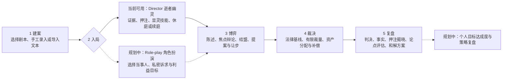
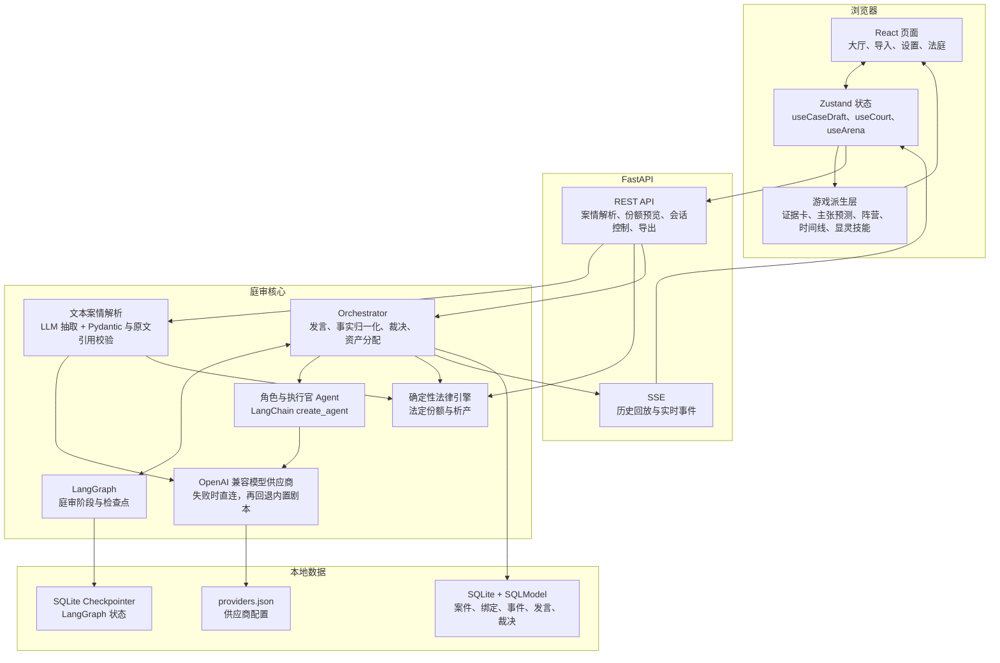
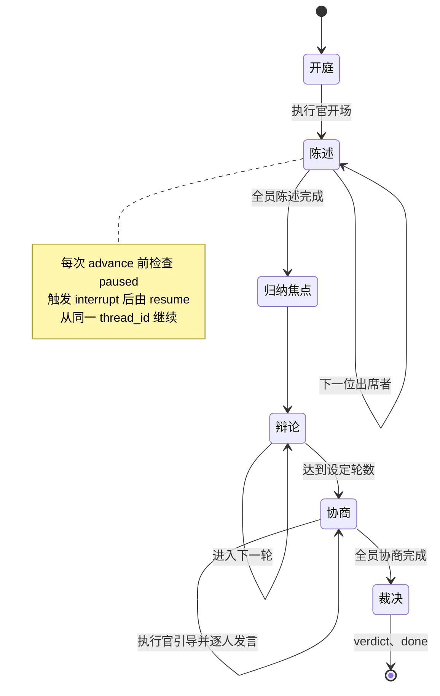
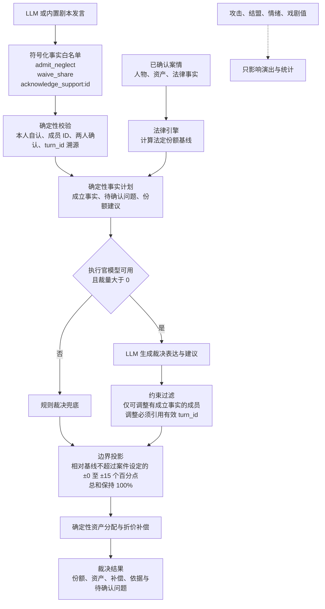
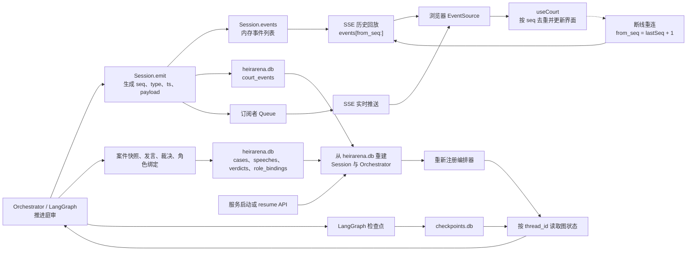

# HeirArena · 图表

本文图表以当前仓库代码为准；尚未实现的能力统一标为“规划中”。当前只支持 Markdown / 纯文本案情导入，不包含 OCR、RAG 或图数据库。

## 1. 五步玩家旅程

当前可用的是 Director（旁观导演 / 逝者幽灵）模式：玩家建案后观看 Agent 庭审，收集证据、预测与押注，并消耗能量施放显灵技能。Role-play（角色扮演）分支仍在规划中。

实线表示当前已实现链路，虚线表示规划能力。角色 Agent 当前自动发言；玩家尚不能选择某位当事人并直接参与回合。

## 2. 系统架构

前端通过 REST 创建和控制会话，通过 SSE 消费庭审事件。后端把模型表达、LangGraph 编排、确定性法律计算和 SQLite 持久化分开。

案情解析仅接受 UTF-8 的 `.md`、`.markdown` 和 `.txt` 内容。模型不可用时庭审发言可降级到剧本；案情解析本身则要求可用模型。

## 3. LangGraph 庭审状态机

代码中的 LangGraph 只有一个 `advance` 节点循环执行，具体阶段由 `CourtState.phase` 和发言人索引推进；下图展开其业务状态。

每次 `advance` 只推进一位发言者或一次阶段切换。休庭标记会在下一节点触发 `interrupt`，续庭通过同一 `thread_id` 的检查点恢复。

## 4. 裁决双路径

LLM 负责表达和提交受限的符号化事实，数值份额始终经过确定性代码计算与边界投影；攻击、结盟、口才和戏剧值不能直接改变份额。

执行官模型可以润色判决、提出资产偏好，并在用户设定范围内建议调整；无成立事实的成员会保持法定份额，不合法输出会被过滤或回退。

## 5. SSE、持久化与恢复

同一庭审事件先进入会话内存，同时写入应用数据库并推送订阅队列。浏览器记录最后序号，断线后用 `from_seq` 只补播未消费事件。

`heirarena.db` 保存可回放的业务数据；`checkpoints.db` 保存 LangGraph 执行位置。启动时只自动重建状态为 `running` 或 `paused` 的案件，运行中的案件会继续推进，暂停案件等待显式续庭。

## 6. 项目目录

下图只列当前仓库中实际存在、与运行或协作直接相关的目录和关键文件。

```mermaid
flowchart TB
    Root["HeirArena 仓库"]
    Root --> GH[".github/workflows<br/>CI"]
    Root --> Assets["assets<br/>角色像素素材"]
    Root --> Backend["backend"]
    Root --> Docs["docs"]
    Root --> Examples["examples<br/>sample-case.md"]
    Root --> Frontend["frontend"]
    Root --> Scripts["start.ps1、start.sh"]
    Root --> Meta["README.md、CONTRIBUTING.md、LICENSE"]

    Backend --> App["app"]
    Backend --> Tests["tests<br/>解析、法律、编排、持久化等测试"]
    Backend --> Req["requirements.txt、.env.example"]
    App --> Main["main.py<br/>FastAPI、REST、SSE"]
    App --> ParserFile["case_parser.py<br/>文本案情抽取与校验"]
    App --> Models["models.py<br/>领域模型"]
    App --> Persist["persist.py<br/>SQLModel 持久化"]
    App --> ProvidersFile["providers.py<br/>模型供应商"]
    App --> AgentsDir["agents<br/>LangGraph、Agent、编排、恢复、分配"]
    App --> LegalDir["legal<br/>法条与确定性规则引擎"]

    Frontend --> Public["public<br/>静态图标"]
    Frontend --> Src["src"]
    Frontend --> Build["package.json、Vite 与 TypeScript 配置"]
    Src --> PagesDir["pages<br/>大厅、导入、设置、法庭"]
    Src --> Components["components<br/>证据、时间线、阵营、预测、场景、UI"]
    Src --> StoreDir["store<br/>草稿、SSE 庭审状态、玩家场次存档"]
    Src --> ApiDir["api<br/>REST 客户端与 SSE 订阅"]
    Src --> DataDir["data<br/>内置剧本与选项"]
    Src --> LibDir["lib<br/>证据、预测、显灵技能、音效"]

    Docs --> Diagrams["diagrams.md<br/>本文"]
    Docs --> Screens["images 与 screenshot 文件<br/>项目截图"]
```

运行时生成的 `backend/data`（数据库和供应商配置）已被忽略，不属于已提交源码；前端构建产物和依赖目录同样未列出。
