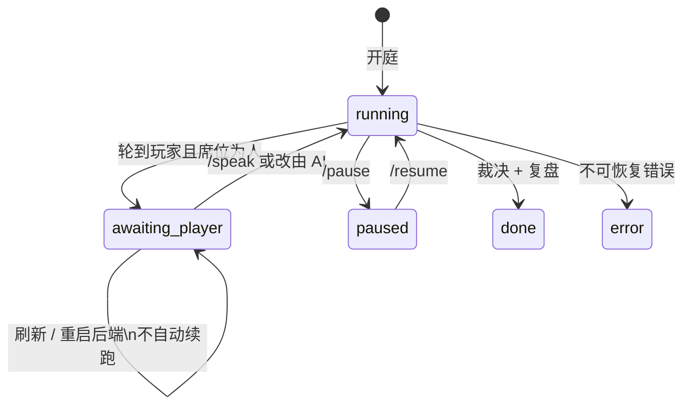

# 入局推演 · 设计说明

本文把 `task/README.md` 里的产品决策整理成一份可以独立阅读的说明。实现拆分仍以 `task/T01`–`T33` 为准。

## 功能一句话

在现有庭审模拟之上加一个开庭模式：用户选定“我是案件中的谁”，用结构化 + 自由文本写下诉求；军师模型为**全员**生成私有策略简报和一张全员最优策略矩阵（对手也按自己的最优打，执行官对席位完全盲判）；用户可以让 AI 代理带简报上庭，也可以随时切换为亲自发言（有发言卡辅助，自认符号只能手动勾选）；裁决后按目标出确定性记分卡、叙事复盘与下一局建议。

定位是**当事人沙盘 + 律师工具**：所有结论锚定规则引擎与当庭成立的事实，证据不足明说，像素外壳照旧。

## 用户旅程

```text
选席 → 写诉求 → 推演策略 → 开庭 → 席位切换与发言 → 复盘 → 导出
```

1. **选席**：设置页第 IV 卷「入局」，或导入页「我是 ___ → 以此视角入局」。可入局成员：任何非宠物、非 AI 分身、未先于被继承人死亡的人。
2. **写诉求**：目标资产（最多 5、可排序）、最低价值份额、红线、软目标、一段自由文本。对手诉求由规则推断，可编辑，可恢复系统推断。填诉求时实时算可达区间；最低份额超出上限给非阻断警告。
3. **推演**：点「推演策略」得到全员矩阵、七节简报、博弈表 a/b/c/d。无军师时降级为规则版。改诉求后需重新推演。
4. **开庭**：席位初值和军师槽位随案件提交。入局会话关闭幽灵插话（`/interject` 返回 409）。
5. **席位切换、举证与发言**：开关「本席由我发言」随时可切。轮到我时进入 `awaiting_player`，可从庭前 what-if 清单提交一项结构化材料，再打字、用发言卡或「改由 AI 代说」。自认只能显式勾选。等待无超时，刷新或重启后端仍停在这一步，不会自动续跑。
6. **复盘**：闭庭后计算全员记分卡；叙事与下一局建议只给玩家。庭审页切到「入局」Tab。
7. **导出**：Markdown 在免责声明之前追加「入局推演报告」。旁观会话导出与改动前一致。

## 数据模型概览

定义在 `backend/app/models.py`：

| 类 | 作用 |
| --- | --- |
| `SeatConfig` | 席位：`player_id`、全员 `goals`、`seat_human`、`advisor_model`、`strategy` |
| `Goals` / `RedLine` / `SoftGoal` | 结构化诉求 |
| `Brief` / `BriefItem` | 七节策略简报 |
| `StrategyPack` / `MatrixRow` | 全员矩阵 + 简报 + 博弈表 |
| `Reachability` / `WhatIfDelta` | 可达区间与事实开关差分 |
| `GameTables` / `CoalitionRow` / `AssetCompetitionRow` / `PayoffRow` / `EquilibriumRow` | 博弈 a/b/c/d |
| `Scorecard` / `ScorecardPart` | 确定性记分卡 |
| `SeatAnalysis` | `/api/seat/analyze` 返回体 |

运行态在 `backend/app/agents/orchestrator.py`：

| 类 | 作用 |
| --- | --- |
| `SeatRuntime` | `human`、`awaiting`、`cards`、`pending`、`evidence`、`debrief` |
| `Session.seat` | 旁观为 `None`；入局随 extras 落库 |

前端镜像在 `frontend/src/types.ts`，另有 `SpeechCard`、`AwaitingInfo`、`Debrief`、`PlayerSpeech`。

## 状态机



`awaiting_player` 会出现在可恢复会话列表里，但启动时不会自动 `_spawn`。

## 信息隔离

| 谁 | 能看到 |
| --- | --- |
| 执行官 | 案情、法定份额、当庭符号化事实。提示词不含诉求、简报、席位。 |
| 玩家简报 | 公开信息 + 全员诉求（含用户改过的对手诉求）。 |
| 对手简报 | 公开信息 + **该对手自己的**诉求。不含玩家最低份额、红线、软目标、自由文本，也不含其他对手被编辑过的诉求。 |
| 复盘叙事 | 只给玩家。记分卡给全员。 |

## 达成度公式

目标资产 40 分（第一目标占其中 60%、第二 30%、第三 10%）、最低份额 30 分（未达按缺口线性扣）、红线 20 分（破一条本项归零且总分上限压到 40）、软目标 10 分。未设定的项不计分，总分按已设定项换算到 100 并注明。软目标与自定义红线需军师评分；无军师时该项灰显。

## 全局不变量

1. 执行官的任何提示词不含诉求、简报、席位信息。
2. 法定基线只随通过 what-if 与材料类型双重白名单的庭上举证重算；酌情份额只随三种符号化事实变动，玩家的自认只来自显式勾选。
3. 对手简报不含玩家的私有诉求，也不含其他对手被编辑过的诉求。
4. `case.seat is None` 时，后端事件序列、提示词、导出内容与改动前一致。
5. 等待玩家的会话重启后仍处于等待，不会被自动续跑。

## 术语表

| 术语 | 含义 |
| --- | --- |
| 席位 / 玩家 | 用户选定的“我是谁”（`seat.player_id`） |
| 入局推演 | 带席位与诉求的开庭模式（`case.seat != None`） |
| 军师 | 策略顾问模型槽位（`seat.advisor_model`） |
| 简报 | 每位成员私有的七节策略（`Brief`） |
| 矩阵 | 全员最优策略矩阵（`MatrixRow[]`） |
| 可达区间 | 我方有利事实全开的上限与对方不利事实全开的下限 |
| what-if | 单个事实开关对法定份额的差分 |
| 举证清单 | 杠杆 → 证据类型 → 法条 的静态表（`legal/evidence.py`） |
| 记分卡 / 复盘 | 目标达成度（`Scorecard`）与叙事复盘（`Debrief`） |

命名空间统一用 **`seat`**，不要用 `arena`（那是幽灵显灵能量存档）。

## 已知限制与后续

已补齐的后续能力：玩家只能在自己的发言回合举证，每回合最多一项；事实必须来自本案 what-if，材料类型必须来自静态举证清单。后端将材料随会话持久化并发布 `evidence` 事件，裁决时在案件副本上重放后重算法定基线，判决、复盘与导出保留材料 ID。材料摘要不进入模型提示词。

仍不做真实文件上传、真实性 / 合法性 / 证明力鉴定、撤证与对方质证；“沙盘采信”只代表确定性模拟。后续可做多次推演、对手强度、庭审中实时 what-if 与完整质证流程。
